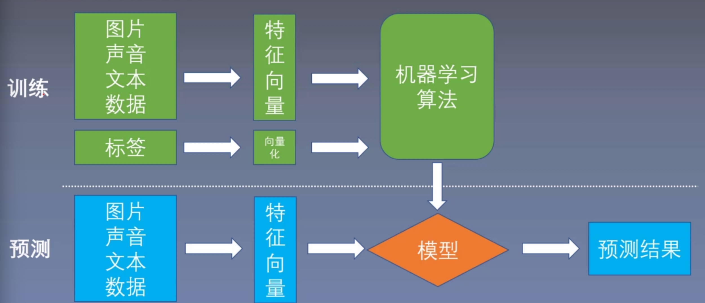
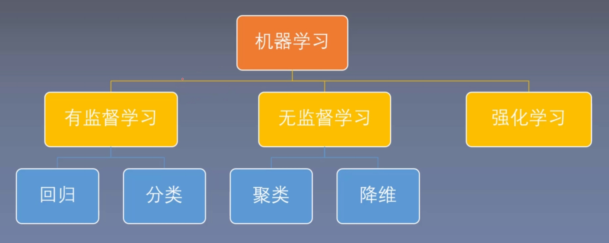

Chapter 1 Introduction

## 1. Machine Learning application
* Computer vision
* Natural language processing
* Speech recoginition

## 2. Machine Learning process
1. Data collection
2. Data cleaning (e.g. data missing, incorrect data)
3. Feature engineering (e.g. data normalisation, reduce dimension )
4. Data Modelling 

## 3. Machine Learning classification
* **Supervised learning:** X has corresponding tag Y. e.g. Data regression, classification

* **Un-supervised learning:** X don't have corresponding tag Y. e.g. Clustering, Dimensionality reduction

* **Reinforcement learning：** Reinforcement learning is an area of machine learning concerned with how software agents ought to take actions in an environment in order to maximise the notion of cumulative reward. 根据具体情况不断的尝试，从而达到最大输出。和前两者不同，该模型不需要大量的数据“喂养”，而是通过自己不停的尝试来学会某些技能。

## 4. Preliminary knowledge for machine learning
* Advanced Mathematics
* Linear Algebra 
* Probability
* Python
